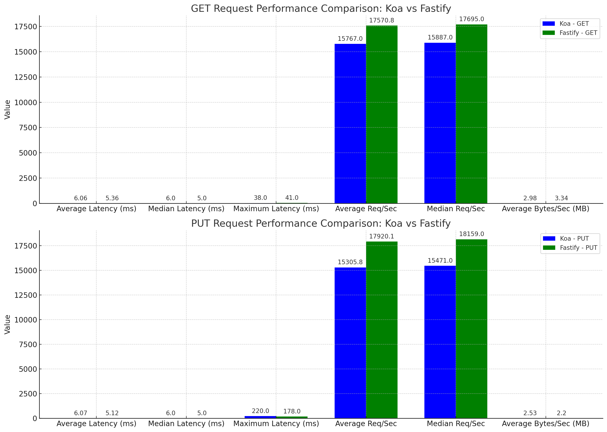

# **pm-city-population-service**

The inspiration for this project came from the prompt in the main directory. The crux of it is to compare different nodejs implementations and emphasis on good code structure, minimal third-party module usage along with prioritizing response time and high throughput.

## **Methodology**

### **Frameworks**

The two different Nodejs framework compared were:

- Koa: highly modular framework, developed from Express
- Fastify: a newer, supposedly quicker framework

In order to minimize 3rd party modules I took my implementation to the extreme and used native features of javascript as much as reasonably possible. For instance, instead of using ioredis, I opted to build my own transactional file client to work with csv files. In retrospect, this probably should've been a serializable format like json but that could be the next thing to compare!

### **Code Structure**

A modular approach was used focusing heavily on the single responsibility principle of SOLID design, which makes the code more readable, maintainable and scalable.
**Separation of Concerns and Modularity**

- Clients: Handles file operations (could be expanded to database client operations).
- DAO (Data Access Object): Handles data retrieval and manipulation.
- Helpers: Utility functions and data validation.
- Routes: Handles routing and HTTP request/response.
- Service: Business logic and data processing.
- Exit Hook: Used to shutdown gracefully

**Other**

- Configurability: dynamic loading of variables in .env file
- Automatic data loading: downloadPopulationData.sh script loads fresh data each start from github repo for cache.
- Asyncronous use in code
- Dev Experience: nodemon (dynamic reloading upon save), prettier formatting on save, ghooks to ensure consistent practices between developers.

### **Framework Comparison Methods and Summary**

**Performance Testing**

Done with [autocannon](https://www.npmjs.com/package/autocannon)

- PUT test: autocannon -c 100 -d 40 -m PUT --body '5000' -H "Content-Type: text/plain" http://127.0.0.1:5555
- GET test: autocannon -c 100 -d 40 http://127.0.0.1:5555/api/population/state/Alabama/city/Marion

Fastify outperformed Koa in nearly every aspect since it managed to process more requests in the same amount of time with slightly better latency.

**GET Request Performance Comparison:**
The bar chart provides a clear comparison between Koa and Fastify for GET requests. We can observe that:

- Fastify has a slightly lower average and median latency than Koa.
- Although Fastify's maximum latency was slightly higher, its average and median request rates (Req/Sec) were better.
- Fastify also showed better data throughput (Bytes/Sec) on average.

**PUT Request Performance Comparison:**
From the second bar chart, comparing PUT requests:

- Fastify again exhibited a lower average and median latency.
- Koa had a significantly higher maximum latency.
- Fastify surpassed Koa in terms of average and median request rates.
- Koa had a slightly better data throughput on average, which might be due to differences in response content or headers.

In conclusion, based on the provided metrics and visualizations, Fastify seems to be more performant than Koa for both GET and PUT requests. However, this was a fairly simple test and results may change with different middlewares used (e.g. things like validation, security, health checks).

**Next Steps**

- Testing (Jest)
- Logging (Pino)
- CI/CD (Jenkins, AWS)
